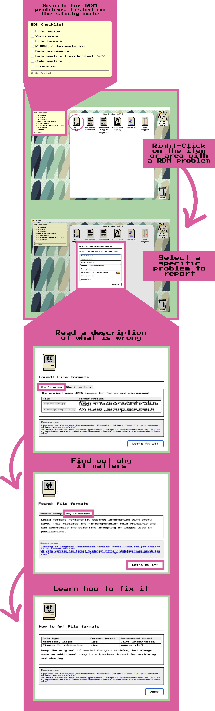

# RDM Scavenger Hunt

A browser-based educational game teaching Research Data Management (RDM) best practices through a faithful recreation of the Classic Mac OS (System 7) desktop. Players inherit a deliberately broken fake research project, explore its files, and right-click anything that looks wrong to report an RDM violation. Each correct find reveals a full explanation drawn from the original workshop answer key. There is **no server, no database, no login**; the app is a pile of static files (HTML, JS, CSS, JSON, images) that any web host can serve. That constraint drove almost every design decision.

Designed as a hands-on companion to the Lib4RI **Basics of Research Data Management** workshop.

[Play a beta version here](https://chasenunez.github.io/RDM_CLASSIC/)  

[Submit bugs here](https://github.com/chasenunez/RDM_CLASSIC/issues)  



---

## How it works

When you open the game you are placed at a System 7 Finder desktop (with some artistic liberties taken). A project folder window is already open, showing the files of a fictional alpine soil study — most of them violating at least one RDM principle.

- **Right-click** (or long-press on touch) any file icon to open a context menu.
- Choose **Report a RDM problem** to flag the file. If correct, a dialog explains what is wrong, why it matters, and how to fix it.
- **Double-click** a file to open it in a viewer (CSV table, code with line numbers, hex dump for binaries, etc.) and right-click individual cells or lines to find subtler violations.
- Right-click **empty space** in the folder or on the desktop, then choose **Report missing artifact** to flag things that should be there but aren't — a README, a license, a DOI, a backup plan.
- A sticky-note checklist in the corner tracks your finds across the 8 problem categories. Wrong guesses increment a counter but never block you.
- When every problem is found, the project files get reorganized into a tidy folder structure and you are offered a downloadable copy of the full answer key.

Progress is saved to `localStorage` automatically. The Apple menu has a **Reset Game** option if you want to start over.

---
## Development

## 1. Where everything comes from

| Piece                       | Origin                                                                                                                                                                             |
| --------------------------- | ---------------------------------------------------------------------------------------------------------------------------------------------------------------------------------- |
| App skeleton                | The standard **Vite + React + TypeScript** template (`npm create vite@latest`)                                                                                                     |
| React 18, `react-dom`       | npm; the UI framework                                                                                                                                                              |
| `xlsx` (SheetJS)            | npm; parses real `.xlsx` spreadsheet files in the browser                                                                                                                          |
| `papaparse`                 | npm; parses CSV files                                                                                                                                                              |
| `marked`                    | npm; converts Markdown strings to HTML for the teaching dialogs                                                                                                                    |
| Press Start 2P font         | Downloaded and hosted locally in `public/fonts/` so the game works offline; OFL 1.1, credited to CodeMan38 in the project README                                                   |
| The System 7 look           | no UI library. Borders, title-bar stripes, dialogs, and menus are recreated in CSS from screenshots of the real OS |
| Classic Mac-style SVG icons | Drawn by Chase Núñez, committed in `public/icons/` with a `manifest.json` catalog; CC BY-ND 4.0 (see `LICENSE-GRAPHICS.md`)                                                 |
| Sound effects               | all four sounds (chime, bonk, fanfare, "sosumi") are synthesized at runtime with the Web Audio API in `src/lib/sounds.ts`                                     |
| Teaching content            | The Lib4RI "Basics of Research Data Management" workshop answer key, hand-transcribed into `src/data/problems.json`                                                                |
| The "broken" sample files   | Fabricated by hand (a fake manuscript, a deliberately messy spreadsheet, a badly written Python script) and committed verbatim in `public/files/sample_project/`                   |

## 2. The three big architectural ideas

**Idea 1: The game is data, not code.** What files exist, what is wrong with them, and what a right-click reveals are all defined in three hand-edited JSON files: `file-tree.json` (which icons appear), `problems.json` (the teaching text), and `mapping.json` (which click target reveals which problem). The TypeScript code is an *engine* that interprets them. A whole new puzzle can be added without touching a `.tsx` file.

**Idea 2: One state object, one reducer.** All persistent game state (found problems, fixed problems, wrong guesses, open windows, mute flag) lives in a single `PersistedState` object managed by a React `useReducer` in `GameContext.tsx`. Every change goes through a named action (`FIND_PROBLEM`, `OPEN_WINDOW`, `MOVE_WINDOW`, and so on). A one-line `useEffect` saves the whole object to `localStorage` after every change; that is the entire save system.

**Idea 3: Everything is a window.** The folder, the trash, every file viewer, even the animated GIFs are the same `Window` component with different children. A window is just `{id, title, viewerType, x, y, width, height, zIndex}` in an array; a `switch` on `viewerType` picks what renders inside.

Style flows alongside (`mac.css` grows with each component). Nothing on the left imports anything on the right. If you remember one diagram, make it this one.
```
types.ts ──► data/*.json ──► lib/ (pure functions) ──► GameContext ──► components ──► App
```

## 3. The build order

### Phase 1: Scaffold and toolchain

```bash
npm create vite@latest rdm-scavenger-hunt -- --template react-ts
cd rdm-scavenger-hunt && npm install && npm run dev
```

This yields `index.html` (a single `<div id="root">`), `src/main.tsx` (mounts `<App/>` with `createRoot`), and hot reloading. Delete the demo content, then add `"typecheck": "tsc --noEmit"` to the `package.json` scripts; it gets run constantly.

**Milestone:** a blank page served at `localhost:5173`.

### Phase 2: The look, CSS before components

Create `src/styles/` with three files, imported in this order in `App.tsx`: `reset.css` (kills browser defaults), `fonts.css` (a `@font-face` for Press Start 2P and the CSS custom properties `--font-pixel` / `--font-mono`), and `mac.css`, the big one. Start `mac.css` with a `:root` palette block, then build just three classes: `.menu-bar`, `.desktop`, and `.window` with its `__title-bar`, `__close`, and `__body` children (BEM-style naming throughout). Everything else in the file (dialogs, icons, sticky note, tables) is added when its component is.

Why CSS first? Because the aesthetic *is* the app. The retro styling supplies all of the game's whimsy and is the main thing that keeps it from feeling like an ordinary virtual machine. Getting one convincing window on screen confirms that the pixel font, borders, and title-bar stripes work visually before any effort goes into game logic.

**Milestone:** a static, non-functional System 7 window hard-coded in JSX.

### Phase 3: Types and the data files

This phase is why the project uses TypeScript rather than plain JavaScript. Write `src/types.ts` *before* the data. It defines the contract: `FileEntry` (path, name, icon, `viewerType`), `Problem` (id, name, `what`/`why`/`fix` as Markdown strings, resources), the five `Trigger` variants (`file`, `cell`, `line`, `project-absence`, `desktop`), `WindowState`, and `PersistedState`. TypeScript's discriminated unions (`type: 'cell'` vs `type: 'line'`) do real work here; the compiler forces every trigger-handling `switch` to handle every case.

Then comes the logical meat of the app in `src/data/`:

- `problems.json`: 8 problems (`file-naming`, `versioning`, `file-formats`, `no-readme`, `no-backup`, `data-quality`, `code-quality`, `no-license`); `data-quality` carries 8 `subProblems` for the later boss battle.
- `file-tree.json`: one entry per visible file, each pointing at a real file placed in `public/files/sample_project/`.
- `mapping.json`: the trigger groups connecting clicks to problem ids (8 main plus 8 boss-battle cell triggers).

JSON imports are typed with a cast at the top of `GameContext.tsx`: `const problems = problemsData as Problem[]`.

**Milestone:** `npm run typecheck` passes with the data imported and logged to the console.

### Phase 4: The window system (the hardest pure-UI code)

Build `src/components/Window.tsx` plus two helpers:

- `lib/layout.ts`: constants (`MENU_BAR_H = 30`, minimum window size) and `centeredAt(w, h, cascade)`. Constants that must match CSS values carry a comment saying so, a small but important lesson in keeping two sources of truth honest.
- `lib/windowManager.ts`: `clampPosition()`, which keeps at least 40px of a dragged title bar on screen.

Dragging is the classic three-listener pattern: `mousedown` on the title bar records the offset, then attaches `mousemove` and `mouseup` to `document` (not the element; the mouse outruns the div). Resizing repeats the pattern from four corner handles. Focus means "highest zIndex": clicking a window dispatches `FOCUS_WINDOW`, which stamps it with `nextZIndex++`. No sorting, no arrays reordered; the biggest number wins.

**Milestone:** two draggable, resizable, focusable windows with fake content.

### Phase 5: Central state, `GameContext.tsx`

Now formalize state. One file provides:

- the **reducer**: 11 actions, all pure (find/fix problem, wrong guess, open/close/focus/move/resize window, dismiss the two intro screens, toggle mute),
- **persistence** via `lib/persistence.ts`: `loadState()` validates the parsed shape and discards incompatible saves (the storage key is versioned: `rdm-scavenger-hunt:v2`), and `saveState()` runs in a `useEffect` on every change,
- a `useGame()` hook that throws if used outside the provider; fail loudly, fail early.

Ephemeral UI state (which dialog is up, the pending right-click target) stays in ordinary `useState` in the provider. It deliberately does *not* go in the persisted reducer. Separating "game progress" from "what's on screen this second" is the key state-design decision in the app.

**Milestone:** windows survive a page reload.

### Phase 6: Files on screen: icons, folder view, viewers

- `FileIcon.tsx`: icon plus label; double-click opens, right-click reports. The label uses `BreakableLabel.tsx`, a tiny component (21 lines) that inserts `<wbr>` after underscores and dots so `microscopy_sample_12.jpg` wraps nicely.
- `Desktop.tsx`: renders the wallpaper, the sticky-note checklist, two desktop icons (project folder, trash), and maps `openWindows` to `Window` components. `ViewerForWindow` is the `switch` that turns `viewerType` into a viewer.
- Viewers, **built simplest-first**: `TextViewer` (fetch text, render numbered lines, each right-clickable), `ImageViewer` (an ``), `MarkdownViewer` (`marked.parse` into `dangerouslySetInnerHTML`), `CsvViewer` (PapaParse into a `<table>` with right-clickable cells), `XlsxViewer` (SheetJS `XLSX.read` on an ArrayBuffer, with sheet tabs), and `BinaryViewer` (a hex dump; pure string formatting and a great exercise).

All viewers share one hook, `lib/useFileContent.ts`, which fetches from `public/files/sample_project/` and handles loading, errors, and stale-fetch cancellation in exactly one place. When three viewers need the same fetch logic, *that* is the moment to extract a hook, not before.

**Milestone:** double-clicking any icon opens its real file contents.

### Phase 7: The game loop, from right-click to verdict

This is where it becomes a game, in four small pieces:

1. `ContextMenu.tsx`: a positioned `<div>` that appears at the click coordinates, closes on Escape or an outside click, and offers "Report a RDM problem…".
2. `lib/matchTrigger.ts`: the referee, and the only genuinely game-specific algorithm. `matchTrigger(target, mapping)` walks the mapping and returns the problem id whose trigger matches; `matchSelectedProblem()` grades the player's guess as `correct`, `wrong_problem` (real problem, wrong label), or `no_problem`. It is pure, with no React in it, and therefore trivially testable.
3. `ProblemSelectionDialog` (pick a category), which dispatches `FIND_PROBLEM` on success and hands off to `WrongGuessDialog` otherwise; `ProblemReportDialog` shows the what/why/fix Markdown.
4. `StickyNote.tsx`: reads `foundProblems` and renders checkboxes. Pure derived state: it computes, it never dispatches.

Add `lib/sounds.ts` here; each sound is roughly 20 lines of oscillator plus gain envelope. Compare `playChime` (sine, C-E-G arpeggio) with `playBonk` (a square wave sliding from 120 down to 40 Hz) and the whole Web Audio API is taught in one file.

**Milestone:** the full find loop works end-to-end with sound and a checklist.

### Phase 8: Fixes that change the world, `lib/fixActions.ts`

When a player clicks "Let's fix it!", files should get renamed, converted, or archived. The trick, and the most instructive design in the app, is that **nothing is ever mutated**. `file-tree.json` stays frozen; `computeDisplayFiles(baseTree, fixedProblems)` *derives* the current folder contents each render by applying each fixed problem's `FixAction` (`remove`, `archive`, `add`, `organize`) as a pure transformation. Undo, save, and reload all come for free because state is just a list of fixed ids. This phase also adds the archive window and the post-fix `data/`, `manuscripts/`, and `code/` subfolders.

### Phase 9: Set pieces: intro, boss battle, ending

- `TitleSlide` (a click-anywhere hero) and `WelcomeDialog` (instructions styled as a mid-90s instant-messenger chat whose lines appear on a timer).
- **Boss battle**: opening `soil samples.xlsx` triggers a minigame where the 8 `data-quality` sub-problems are individual bad cells (`-999`, `NA`, blanks) reported directly. It reuses everything (the XlsxViewer, cell triggers, the same reducer) plus about 60 lines of state in GameContext: `bossFoundCount` and an effect that detects the found-them-all moment.
- `FileStructureDialog` and then `CompletionDialog` finish the arc.
- Finally, the **modal traffic cop** in `App.tsx`: several dialogs can become eligible in the same instant, so a `MODAL_ORDER` array decides which single one renders, and "automatic" end-game popups wait 1 second so they do not flash in on top of each other. Sequencing overlapping UI is a real problem in every app; this is a clean, readable solution.

### Phase 10: Polish

Touch support (`lib/longPress.ts`, a 500ms long-press hook standing in for right-click), keyboard and ARIA support on every clickable div, and the `asset()` helper prefixing every URL with `import.meta.env.BASE_URL` so the app works under GitHub Pages' `/RDM_CLASSIC/` sub-path (set `base` in `vite.config.ts`). Then `npm run build` and publish `dist/` to Pages.

---

## Prerequisites

| Requirement | Version |
|-------------|---------|
| Node.js | 18 or later |
| npm | 9 or later |

That's all — every asset the game needs is committed in this repo. There are no external source repositories or build-time downloads.

---

## Quick start

```bash
# 1. Clone this repository
git clone <repo-url>
cd rdm-scavenger-hunt

# 2. Install dependencies
npm install

# 3. Start the development server
npm run dev
```

Open [http://localhost:5173](http://localhost:5173) in your browser. The game loads immediately — no login, no backend.

> **The repo is self-contained.** All game content (`public/files/`, `public/icons/`, `public/downloads/`, `src/data/*.json`) is committed and is the source of truth. A fresh clone runs and builds with **no external files and no content-generation step**. To change the game, edit those committed files directly — see [Guide for future additions](#guide-for-future-additions).

---

## Production build

```bash
npm run build
```

`npm run build` runs Vite directly against the committed artifacts. Everything is bundled into `dist/`, which is entirely self-contained: copy it to any static host and it works.

```bash
# Preview the production build before deploying
npm run preview
```

### Deploying

The `dist/` directory can be served from any static host with no configuration:

| Host | How |
|------|-----|
| **GitHub Pages** | Push `dist/` to your `gh-pages` branch, or point Pages at `/dist` |
| **Netlify / Vercel** | Set the publish directory to `dist` and build command to `npm run build` |
| **nginx / Apache** | Copy `dist/` to your web root |
| **S3 / R2** | Sync `dist/` to a bucket with static website hosting enabled |

There is no server-side rendering, no API, and no database. Every asset is a file.

---

## Guide for future additions

### The four moving parts

Everything the game shows and reacts to comes from four places:

| Part | Path | Role |
|------|------|------|
| **The file on disk** | `public/files/sample_project/…` | The actual bytes a viewer loads (served at `/files/sample_project/…`) |
| **The file tree** | `src/data/file-tree.json` | Makes the file appear as an icon and picks its viewer. **This is what the desktop renders — if a file isn't here, it isn't shown.** |
| **The problem** | `src/data/problems.json` | The teaching content (`what` / `why` / `fix` / `resources`) shown when the item is found |
| **The mapping** | `src/data/mapping.json` | Connects a click target (file / cell / line / absence) to a problem `id` |

A "clickable item" only counts as a finding when a **mapping trigger** matches it **and** the referenced problem `id` exists in `problems.json`. Adding a file without a trigger just creates a harmless decoy; adding a trigger whose file isn't in `file-tree.json` creates an unreachable problem (this was a real bug — `raw_data.xlsx` had a trigger but no tree entry).

### Route A: add a new file at the project root with a clickable problem

1. **Drop the file in** `public/files/sample_project/`. Keep the exact name you want shown (spaces and odd characters are fine — they're often the point).

2. **Register it in `src/data/file-tree.json`** so it renders. Add one entry; `path` is relative to `public/files/`, `name` is the bare filename:

   ```jsonc
   {
     "path": "sample_project/lab_notebook.txt",
     "name": "lab_notebook.txt",
     "type": "file",
     "size": 1234,                       // byte size; cosmetic, doesn't need to be exact
     "mimeGuess": "text/plain",
     "icon": "/icons/Text file.svg",     // any name from public/icons/ (see manifest.json)
     "viewerType": "text"
   }
   ```

   `viewerType` decides how a double-click opens it **and** which trigger types are available:

   | `viewerType` | Use for | Supports triggers |
   |--------------|---------|-------------------|
   | `text` | `.txt`, `.py`, `.r`, `.sh` | `file`, `line` |
   | `markdown` | `.md`, `.docx` (rendered) | `file` |
   | `csv` | `.csv` | `file`, `cell` |
   | `xlsx` | `.xlsx` | `file`, `cell` |
   | `image` | `.jpg`, `.png`, `.tif` | `file` |
   | `binary` | `.dat` and other opaque blobs | `file` |

3. **Make sure a problem exists** in `src/data/problems.json`. Reuse an existing `id` (e.g. `file-naming`) or add a new object:

   ```jsonc
   {
     "id": "my-new-problem",
     "name": "Short checklist label",
     "fullTitle": "My New Problem",
     "what": "Markdown explaining what's wrong.",
     "why": "Markdown explaining why it matters.",
     "fix": "Markdown explaining how to fix it.",
     "resources": [{ "title": "A helpful link", "url": "https://example.org" }]
   }
   ```

4. **Wire the click to the problem** in `src/data/mapping.json`. To make the **whole file** clickable, add a `file` trigger; for a specific cell or line, use `cell` / `line`:

   ```jsonc
   {
     "id": "my-new-problem",
     "triggers": [
       { "type": "file", "path": "lab_notebook.txt" },     // bare filename
       { "type": "line", "path": "lab_notebook.txt", "line": 4 }  // 1-indexed
     ],
     "matchRule": "any"
   }
   ```

   - `cell` triggers need `row` (0-indexed from the top of the file) and `col` (0-indexed).
   - `line` triggers need `line` (1-indexed).
   - One file can carry several triggers, and a problem can have triggers across several files.

5. **Run `npm run typecheck` and `npm run dev`**, then double-click your file and right-click the item to confirm the correct problem is revealed. The app reads these JSON files directly — there is no build or generation step to run.

### Route B: put the file in a **new location** (a subfolder)

The folder window shows root-level files plus folder icons. Files are placed into a subfolder by **name**, via the organize map — there are two ways to do it:

**B1 — a subfolder that exists from the start.** Add a `folder` entry and give the file a nested `path`. The folder name is matched by the part of `path` after `sample_project/`:

```jsonc
// in src/data/file-tree.json
{ "path": "sample_project/archive", "name": "archive/", "type": "folder",
  "size": 0, "mimeGuess": "inode/directory", "icon": "/icons/Floppy.svg", "viewerType": "folder" },
{ "path": "sample_project/archive/old_readme.txt", "name": "old_readme.txt", "type": "file",
  "size": 200, "mimeGuess": "text/plain", "icon": "/icons/Text file.svg", "viewerType": "text" }
```

Put the real file at `public/files/sample_project/archive/old_readme.txt`. Triggers still use the **bare filename** (`"path": "old_readme.txt"`), not the nested path.

**B2 — a subfolder that appears as a reward after a fix.** This is how the existing game does "organize your files." Subfolders that open on double-click are driven by `FIX_ACTIONS['file-structure'].organize` in `src/lib/fixActions.ts` — a map of `folder name → file names`. When `file-structure` is fixed, those files move into `_sub/<folder>/…` and the folder becomes openable. To add a file to an organized subfolder, add its **name** to the relevant array:

```ts
organize: {
  'data':        ['raw_data.xlsx', 'fig1_updated.png', 'my_new_data.csv'],  // ← added
  'manuscripts': [ … ],
  'code':        [ … ],
},
```

### How to make the file change after a fix

`src/lib/fixActions.ts` controls what happens to the folder view when a problem is fixed (the "Let's fix it!" flow). Each problem `id` maps to a `FixAction`:

- `remove` — filenames to hide from the folder view
- `archive` — filenames to move into the `archive/` window (must be a subset of `remove`)
- `add` — new `FileEntry` objects to display (these are **virtual** — set `virtual: true`; they're loaded from `public/files/` by path, so the file must exist on disk if it has a viewer)
- `organize` — only on `file-structure`; the subfolder map from Route B2

> A file that lives in `file-tree.json` (a base file) must **not** also appear in a fix's `add` array, or it renders twice after the fix (`computeDisplayFiles` doesn't dedupe base vs. add). Use `add` only for files that don't exist until a fix happens.

### Checklist before you commit

- [ ] File exists under `public/files/sample_project/…`
- [ ] Entry added to `src/data/file-tree.json` with the right `viewerType`
- [ ] Problem `id` exists in `src/data/problems.json`
- [ ] Trigger in `src/data/mapping.json` references the **bare filename** and a real problem `id`
- [ ] `npm run typecheck` passes and the item is findable in `npm run dev`

## Editing `mapping.json`

`src/data/mapping.json` is the bridge between what a player right-clicks and which problem ID that reveals. It is hand-edited and committed — the source of truth for every trigger.

```jsonc
{
  "problems": [
    {
      "id": "file-naming",
      "triggers": [
        { "type": "file",  "path": "soil samples.xlsx" },
        { "type": "file",  "path": "cleaned data.xlsx" }
      ],
      "matchRule": "any"
    },
    {
      "id": "no-metadata",
      "triggers": [
        { "type": "cell", "path": "soil_samples_preview.csv", "row": 2, "col": 1 }
      ],
      "matchRule": "any"
    }
  ]
}
```

### Trigger types

| Type | When it fires | Required fields |
|------|---------------|-----------------|
| `file` | Right-clicking a file icon | `path` — the bare filename (e.g. `"soil samples.xlsx"`) |
| `cell` | Right-clicking a cell inside the CSV or XLSX viewer | `path`, `row` (0-indexed from top of file), `col` (0-indexed) |
| `line` | Right-clicking a line inside the text/code viewer | `path`, `line` (1-indexed) |
| `project-absence` | Choosing an item from the "Report missing artifact" submenu | `name` — must match the `name` on a `project-absence` trigger (currently `.git`, `README`, `LICENSE.md`) |
| `desktop` | Right-clicking empty space in the folder window or desktop background | *(no extra fields)* |

`matchRule: "any"` means **any one** matching trigger marks the problem as found. This is the only supported value; there is no "all" mode.

Edit `src/data/mapping.json` directly and reload — the app reads it at runtime, so there is no regeneration step.

## Project structure

```
rdm-scavenger-hunt/
├── public/
│   ├── files/                   # the sample project files (verbatim names — served at /files/)
│   ├── icons/                   # SVG icons + manifest.json
│   ├── downloads/               # RDM_Guide.html — offered as download at game end
│   ├── fonts/                   # locally hosted Press Start 2P font
│   └── sounds/                  # empty — sounds are generated via Web Audio API
├── src/
│   ├── components/
│   │   ├── Desktop.tsx          # desktop area, folder view, window rendering
│   │   ├── MenuBar.tsx          # top menu bar with Apple menu
│   │   ├── Window.tsx           # generic draggable, focusable window chrome
│   │   ├── FileIcon.tsx         # individual file icon with right-click / long-press
│   │   ├── ContextMenu.tsx      # right-click menu with Report / Report missing
│   │   ├── StickyNote.tsx       # 8-item checklist, top-left of desktop
│   │   ├── WelcomeDialog.tsx    # first-load instructions
│   │   ├── ProblemReportDialog.tsx  # shown on correct find (tabbed: what / why / fix)
│   │   ├── WrongGuessDialog.tsx # shown on wrong guess or already-found repeat
│   │   ├── CompletionDialog.tsx # shown after all 8 found
│   │   └── viewers/
│   │       ├── TextViewer.tsx   # .txt .py .md — line-by-line with right-click
│   │       ├── CsvViewer.tsx    # .csv — table with right-clickable cells
│   │       ├── XlsxViewer.tsx   # .xlsx — SheetJS parse, same table UI, sheet tabs
│   │       ├── ImageViewer.tsx  # .jpg .png — centred image, right-click for format issues
│   │       └── BinaryViewer.tsx # .dat .docx — text preview + hex dump
│   ├── data/
│   │   ├── problems.json        # SOURCE OF TRUTH — hand-edit (teaching content)
│   │   ├── file-tree.json       # SOURCE OF TRUTH — hand-edit (what the desktop shows)
│   │   └── mapping.json         # SOURCE OF TRUTH — hand-edit (click → problem)
│   ├── lib/
│   │   ├── matchTrigger.ts      # maps a right-click target to a problem ID
│   │   ├── persistence.ts       # localStorage read/write
│   │   ├── longPress.ts         # touch long-press hook (500 ms threshold)
│   │   ├── windowManager.ts     # z-order and drag clamping utilities
│   │   └── sounds.ts            # procedural chime / bonk / fanfare via Web Audio API
│   ├── styles/
│   │   ├── reset.css            # minimal reset
│   │   ├── fonts.css            # font-family custom properties
│   │   └── mac.css              # all System 7 chrome: title bars, dialogs, menus, icons
│   ├── types.ts                 # shared TypeScript interfaces
│   ├── GameContext.tsx          # global state — useReducer + localStorage persistence
│   ├── App.tsx                  # root component, overlays, completion sequence
│   └── main.tsx                 # React entry point
├── index.html
├── vite.config.ts
├── tsconfig.json
└── package.json
```

## Sounds

All sounds are generated at runtime using the Web Audio API and no external audio files are used. 

## License

| Component | License |
|-----------|---------|
| Game source code | MIT (see [LICENSE](LICENSE)) |
| Graphics and icons | original artwork by Chase Núñez. [CC BY-ND 4.0](https://creativecommons.org/licenses/by-nd/4.0/): free to reuse with attribution, no modifications (see [LICENSE-GRAPHICS.md](LICENSE-GRAPHICS.md)) |
| Press Start 2P font | OFL 1.1 (CodeMan38) |
